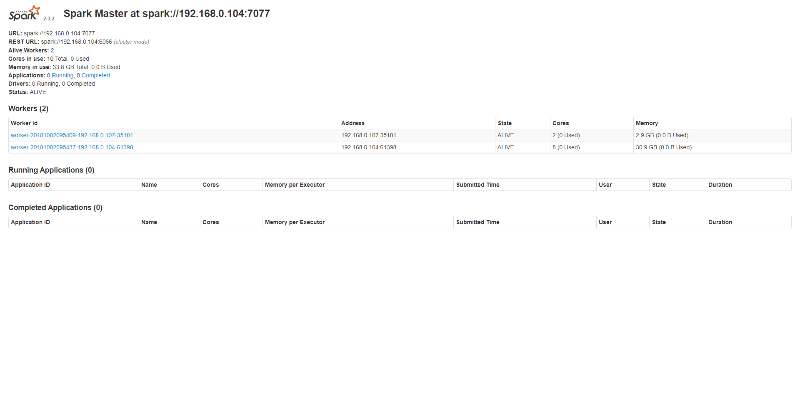

## Windows

```shell
    # to start the master node 
    spark-class org.apache.spark.deploy.master.Master
    # see the terminal to check the running site. Generally it runs on 8080 port


    # to start a slave node
    spark-class org.apache.spark.deploy.worker.Worker spark://<active network machine ip>:7077
```

## Ubuntu


```shell
    # to start the master node 
    # go to spark sbin folder and run
    ./start-master.sh
    # see the log to check the running site. Generally it runs on 8080 port


    # to start a slave node
    ./start-slave.sh spark://<active network machine ip>:7077
```

## Connected Dashboard

The connected dashboard looks like this




